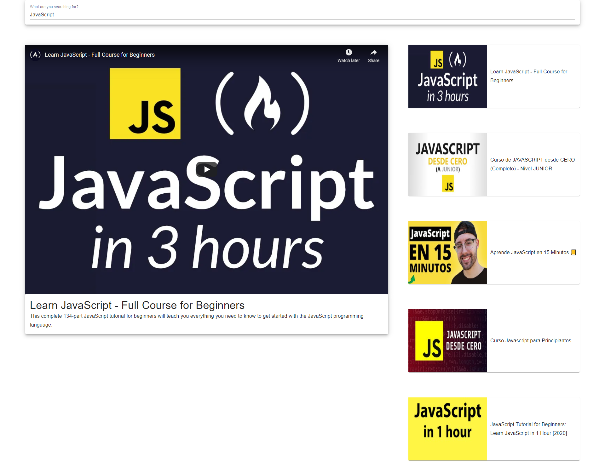

# Reactube

Youtube clone using React



## 📌 Getting started

```instruction
- npx create-react-app Reactube
- cd Reactube
- npm start

- npm install axios
```


## 📌 Instructions

### Create

- Component App
- Component SearchBar
- Component VideoList
- Component VideoItem
- Component VideoDetail

## 📌 Technologies

- HTML
- CSS
- JavaScript
- React
- Axios
- Bootstrap

## 📌 API

- [Youtube](https://developers.google.com/youtube/v3/docs?hl=es)
